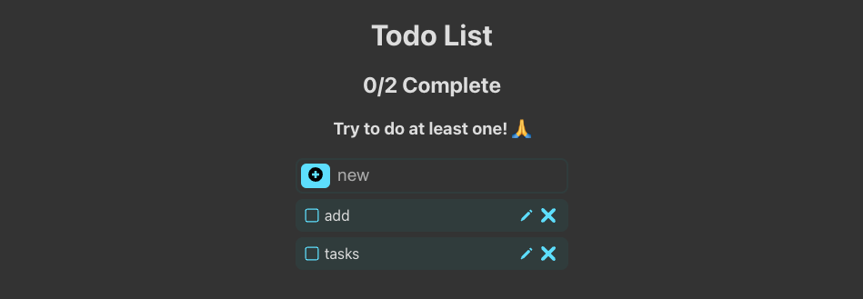

# Todo App

This project is referenced from YouTube and some personal modifications.

crud-todo-app/
├── public/
│   └── index.html
├── src/
│   ├── api/
│   │   └── todoApi.js         // Handles all API calls
│   ├── components/
│   │   ├── Checkbox.js        // Your checkbox component
│   │   ├── RenameForm.js      // For renaming a task (submit-based)
│   │   ├── Task.js            // Task component (uses RenameForm & TaskTools)
│   │   ├── TaskForm.js        // For adding a new task
│   │   └── TaskTools.js       // Contains Edit and Delete icons/buttons
│   ├── App.js                 // Main app component
│   ├── App.css
│   └── index.js               // Entry point for React
├── package.json
└── README.md

## Tech used

* ReactJs
  * useState
  * useEffect
* localStorage
* css transitions

## Pending Work

* Test Cases
* Unit Testing

## Screenshots

